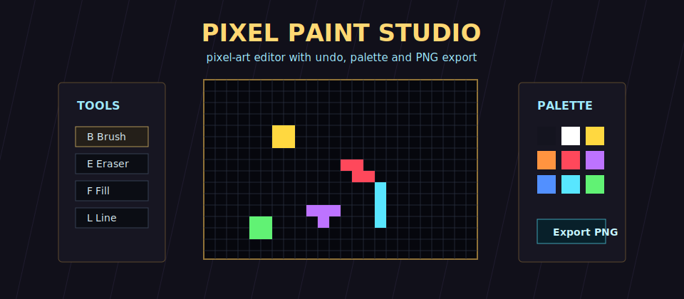

# Pixel Paint Studio

<p align="center">
  
</p>

<p align="center">
  <a href="https://github.com/noirdaisyq/pixel-paint-studio/releases/latest"></a>
  
  
  
</p>

Pixel Paint Studio is a portfolio-ready pixel-art editor built with Rust and macroquad. It now opens with a project setup screen, lets you choose canvas presets and background mode, then gives you a fuller Paint-style workspace with palette workflow, history stack, shape tools and PNG export.

## Features

- Startup project setup with 16x16, 32x32, 48x48, 64x64, 96x64 and 128x128 presets.
- Transparent, white or dark canvas background.
- Optional demo art now starts with a small pixel cat.
- Brush, eraser, bucket fill, color picker, line, rectangle, ellipse, spray, mirror and dither tools.
- Palette with current-color preview.
- New project, clear, grid, undo and redo actions in the UI.
- Undo/redo history.
- PNG export to the local `exports/` folder.
- Responsive windowed UI with a neon tool-studio style.

## Run

```powershell
cargo run --release
```

## Controls

```text
B / E / F      brush, eraser, fill
I / L / R      picker, line, rectangle
O / S / M / D  ellipse, spray, mirror, dither
Ctrl+N         new project setup
Ctrl+Z / Y     undo, redo
Ctrl+S         export PNG
G              toggle grid
- / + buttons  brush size
- / =          brush size from keyboard
[ / ]          alternative brush size keys
Delete         clear canvas
Shift+Shape    filled rectangle or ellipse
```

## Build

```powershell
cargo build --release
```

The release executable is created at `target/release/pixel-paint-studio.exe`.
